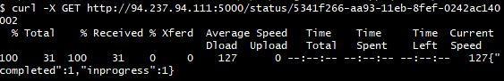

# Image Crawler

### Goal

1. An application must take the form of a Web API server.
2. We expect that the app will take a list of URLs as input and a number of threads,
and return a job ID used to fetch crawling information/results.
3. The app should be able to run multiple crawling jobs at the same time.
4. We expect to be able to get information/results about a running/finished job
from your application (using its job ID).
5. The data extracted will be a list of image URLs (gif, jpg, png) as output.
6. The app should crawl the URLs recursively only until the second level
(to avoid a large amount of data): Fetch the images for each given URL and their children.
7. By default, the app will crawl using one thread/coroutine, however,
we should be able to specify the number of thread/coroutine to use when creating a new job.

## Getting started

Let's start by cloning the repository by running below command in cmd
<br><br> `$> git clone https://github.com/Navjotbians/image-crawler-app` <br>
`$> cd repository` <br>
`$> docker-compose up` <br>

## Run following commands 

```bash
$> curl -X POST http://localhost:5000/ -H 'Content-Type: application/json'  -d '{"n_threads": 2, "urls": ["https://golang.org", "https://4chan.org/"]}'` <br>
```
 <br>
Specify number of thread you want to use and URLs
<br>
<br>
`$> curl -X GET http://localhost:5000/status/5341f266-aa93-11eb-8fef-0242ac140002` <br>
 <br>
Give status of the task
<br>
<br>
`$> curl -X GET http://localhost:5000/result/5341f266-aa93-11eb-8fef-0242ac140002` <br>
 <br>
Give all the found URLs
<br>
<br>
`$> curl -X GET http://localhost:5000/statistics` <br>
 <br>
Provides information on task execution like how many links have been processed and time taken by them.

## Improvement Scope
* Multi-threading and coroutine can be used to see if the throughput time improves
* GUI can be built for easy access and visually appealing results
* Funtions can be put into seperate scripts so that we have simple and readable `app.py` but in this case `Manager` need to be used to make this thing work  


